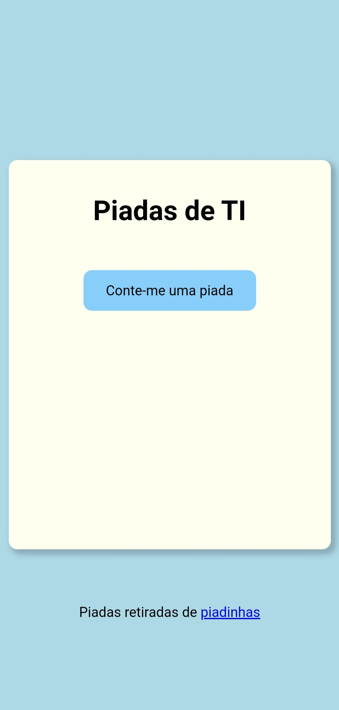
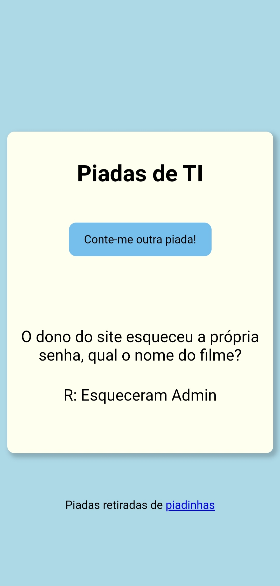

# Contador de piadas
 

# Sobre o projeto

https://rodrigues14.github.io/contador-piadas/

Projeto criado com o intuito de colocar meus conhecimentos em prática.

## Layout mobile

     

## Layout web

# Tecnologias utilizadas

- HTML5
- CSS3
- JavaScript

## Implantação em produção
- Front end web: github pages

# Autor

Lucas Rodrigues Souza

https://www.linkedin.com/in/lucas-rodrigues-perfil/
